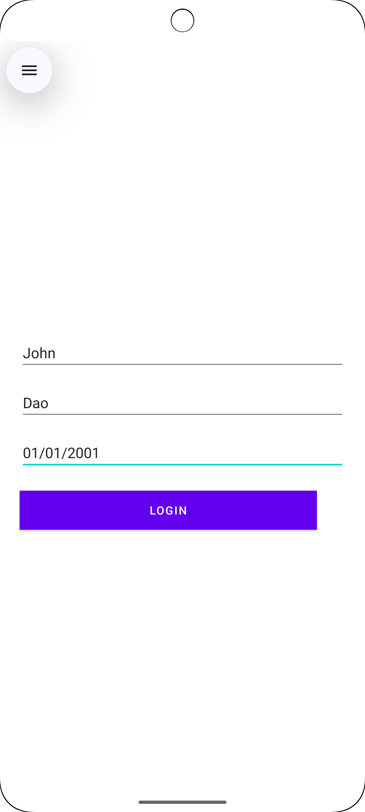
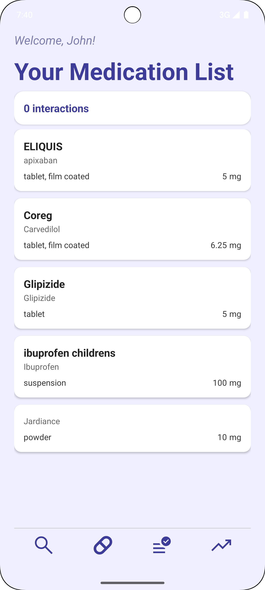
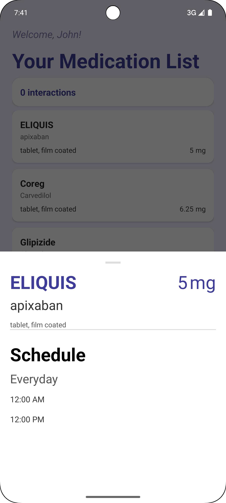
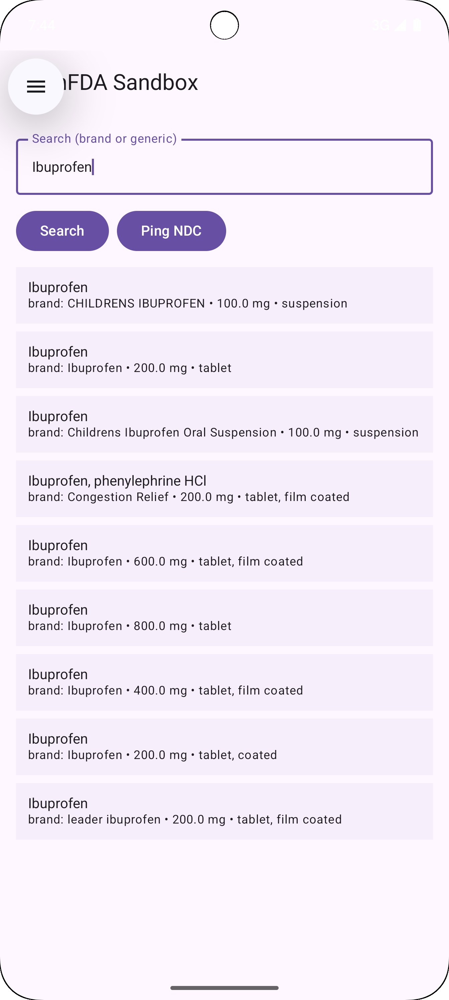

# MediTrack – Medication Manager Android App

**MediTrack** is a Kotlin-based Android mobile app designed to help users manage their medication safely and effectively. The app features a searchable database, interaction checker, side effect viewer and personalized medication scheduling with push notification reminders. Users can log each dose as taken or missed, track adherence statistics, and manage all their medications in one place. Its role can be significant especially for patients with chronic conditions or memory-related challenges like Alzheimer's disease.
Developed as an **independent senior project at Brooklyn College (CISC 4900)**.

## Installation & Setup

Follow these steps to build and run **MediTrack** locally:

1. **Clone the repository**
   ```bash
   git clone https://github.com/IvanStepanov99/MediTrack.git
   cd MediTrack
2. **Open in Android Studio**
    - Launch Android Studio (latest version recommended).
    - Select "Open an existing project" and navigate to the cloned repository folder.
    - Wait for Gradle to sync and build the project.
    - Ensure you have the necessary SDKs and dependencies installed.
3. **Build and run the app**
    - Connect an Android device via USB with Developer Options enabled, or set up an Android Emulator.
    - Click the "Run" button in Android Studio to build and deploy the app to your device/emulator.
    - Enjoy using MediTrack!
   
## Features
- **Browse medications** by name and brand
- **View detailed information**: usage and side effects
- **Edit, delete, or add medications** to your personal list
- **Select multiple medications** to check for possible interactions
- **Set personalized schedules** for each medication
- **Receive reminders and notifications** for upcoming doses
- **Log missed and taken dosages** for tracking
- **Track adherence statistics and intake streaks** over time

## Technologies and Tools Used
- **IDE:** Android Studio
- **Language:** Kotlin
- **UI Toolkit:** Jetpack Compose
- **Database:** Room (Local SQLite)
- **Notifications:** WorkManager + Jetpack Notification API
- **External APIs:** openFDA, DrugBank

## Use Case 1: Add a Medication with Safety Pre-Check

**Steps:**
1. User taps **Add Medication**.
2. Searches for *“Carvedilol”* and selects the first result from the suggested medications.
3. Enters dosage: **10 mg** → Sets schedule: **8:00 PM daily**.
4. The app automatically runs an **interaction check**.

**Expected Output:**
- The medication is **saved to the list** with the next dose scheduled.
- An **interaction warning** is displayed if conflicts are detected with medications already added.


## Disclaimer
This application is an educational project created for academic purposes.
It is **not a prescription service** and should **not** be used as a substitute for any professional or pharmaceutical medical advice.

## Screenshots




